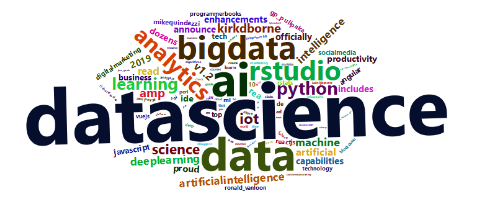

Hello,

I am a grad student at NC State University in Raleigh. I have created this blog as a part of my curriculum for the course ST 558: Data Science for Statisticians. 
Along with grad school I am also working part-time as a software developer for hosted analytics environment. In this blog I intended to cover some of the interesting topics surrounding the field of Data Science, Data Analytics and Statistics.